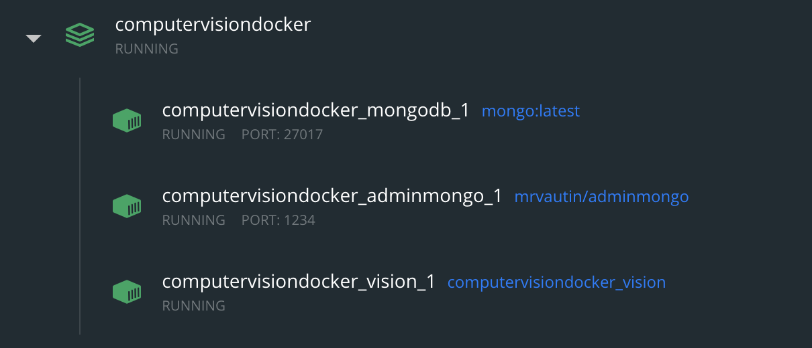
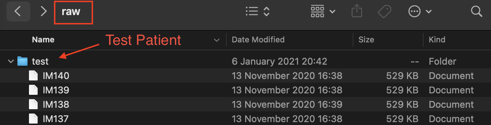
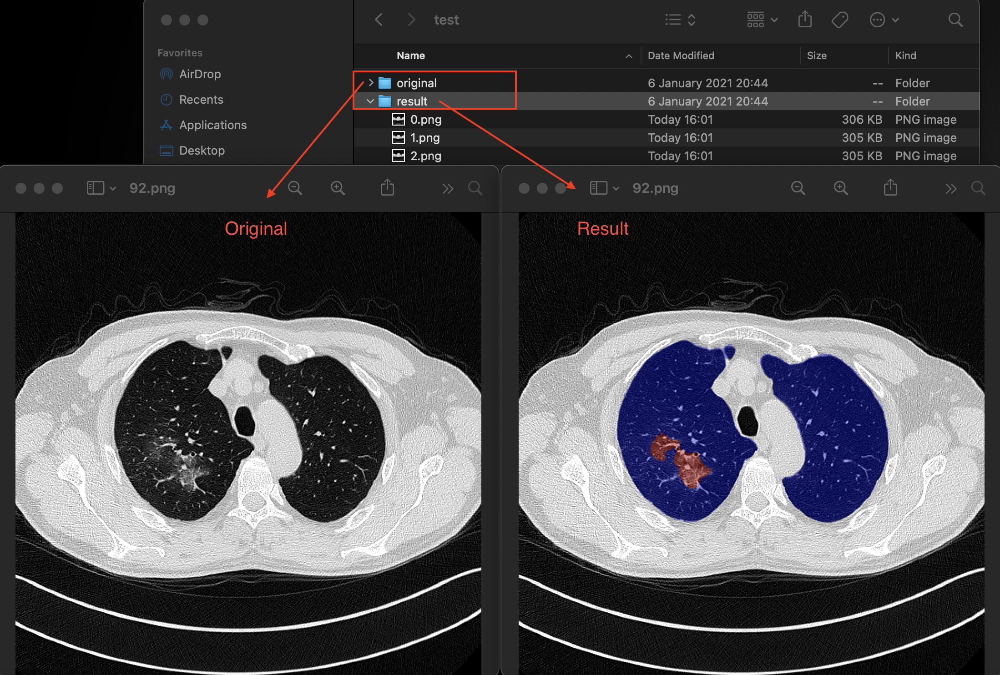

# Covid19 App - Installation with Docker

### Requirements
- Clone this repo
- You must install Docker and Docker-Compose

## Run command to get the code Backend and Weights
```bash
chmod +x installer.sh
./installer.sh
```

## Run command to run the application with Docker Compose
```bash
sudo docker-compose build
sudo docker-compose up
```

## Visit the url to test app database results
```http
http://localhost:1234 Databaseviewer
```

## Usage
- Check Docker Container
  - 

- Move the patient file to the /data/raw folder. App detect patient folder automatically and start preprocessing.
  - 

- The patient Dicom files converts to nifti format.(Dicoms is medical image storing format)

- You can view the results of the prediction operation in "data/processed". There are two folders in "data/processed". "Original" folder contains raw images. Inside the "Result" folder there are segmented results.
  - 